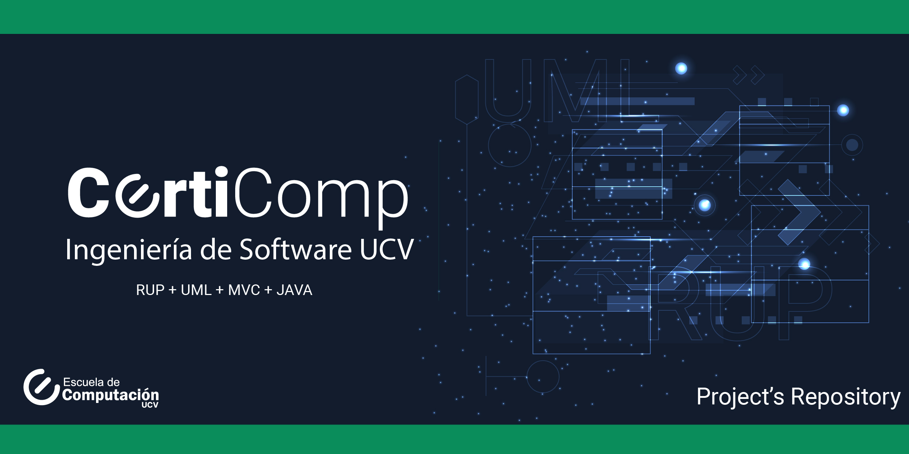

# CertiComp
CertiComp proyecto de Ingeniería de Software

# Integrantes

* Mario Gamez
* Rahigrim Monasterios
* Leonardo Febres
* Ronald Herrera
* Jhonny Zavala
* Vanessa Silvera

# [1. Modelo de Dominio ](#1-Modelo-de-Dominio)
* Diagrama de Clases

* Diagrama de Estados
 

# [2. Diciplina de Requisitos ](#2-Diciplina-de-Requisitos)
* Modelos de Casos de Uso

* Prototipos de Pantalla

# [3. Diciplina de Analisis](#3-Diciplina-de-Analisis)

# [4. Modelo de Diseño ](#4.-Modelo-de-Diseño) 
### **4.2 Diagrama de Secuencia** 
 Caso de uso representativo **Presentar Examen** (*Take Exam*) 

### **4.3 Diagrama de Despliegue**

